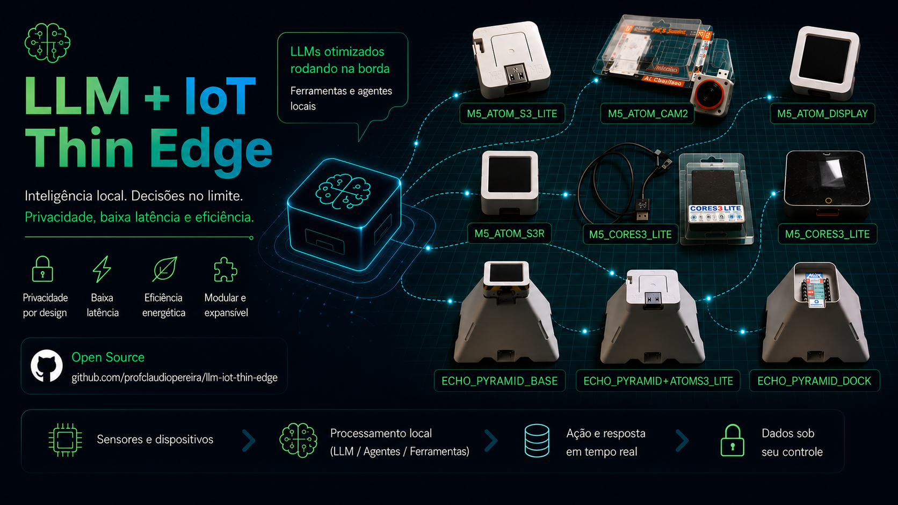

# LLM IoT Thin Edge

Projeto educacional e profissional explorando o conceito de **Thin Edge Devices utilizando LLMs na nuvem** com hardware ESP32-S3 do ecossistema M5Stack.

O projeto evolui incrementalmente através de fases isoladas e funcionais, garantindo que novas funcionalidades não quebrem implementações anteriores.

---

# Objetivos do Projeto

- Explorar arquiteturas Thin Edge Device
- Integrar dispositivos ESP32 com LLMs na nuvem
- Construir sistemas multimodais embarcados
- Criar um projeto de referência didático e profissional
- Preservar evolução arquitetural e histórico de troubleshooting
- Manter cada fase isolada e reproduzível

---

# Filosofia de Arquitetura

Este projeto segue o conceito de:

```text
Thin Edge Device + Cloud-based LLM
```

Fases futuras evoluirão para:

```text
Interactive Embedded AI Runtime
```

e posteriormente:

```text
Hybrid Edge AI Architecture
```

---

# Ecossistema de Hardware

O projeto utiliza dispositivos modulares ESP32-S3 do ecossistema M5Stack.

Devices principais atualmente utilizados:

- AtomS3 Lite
- AtomS3R AI Chatbot
- AtomS3R CAM AI Chatbot
- Echo Pyramid
- CoreS3 Lite
- Module LLM Kit

Mais informações:

```text
docs/devices/
```

---

# Stack Atualmente Validada

- ESP-IDF
- ESP32-S3
- FreeRTOS
- Node.js
- Express
- OpenAI API
- REST API
- HTTP Streaming
- HTTP_EVENT_ON_DATA
- dotenv

---

# Conceitos Atualmente Validados

- Thin Edge Architecture
- Cloud LLM Integration
- Backend Orchestration
- Provider Abstraction
- HTTP Streaming
- Event-driven Networking
- Streaming Responses
- Evolução incremental de runtime embarcado

---

# Estrutura do Repositório

```text
llm-iot-thin-edge/
├── firmware/
├── backend/
├── docs/
│   ├── architecture/
│   ├── devices/
│   ├── diagrams/
│   ├── phases/
│   └── assets/
├── README.md
└── README.pt-BR.md
```

---

# Regras de Desenvolvimento

- Uma fase = uma entrega funcional
- Novas fases não podem quebrar fases anteriores
- Testar em hardware real antes de avançar
- Preservar histórico de troubleshooting
- Manter firmware isolado por fase
- Preservar evolução arquitetural

---

# Fases Planejadas

| Fase | Descrição |
|---|---|
| 01 | Fundação Wi-Fi |
| 02 | Comunicação HTTP |
| 03 | Integração Cloud LLM |
| 04 | Display Runtime |
| 05 | Voice Interaction |
| 06 | Vision Pipeline |
| 07 | IA Multimodal |
| 08 | Hybrid Local LLM |

---

## Observações de Compatibilidade de Hardware

As fases iniciais do projeto foram propositalmente desenvolvidas para permanecerem independentes de hardware específico.

As fases:

```text
01 — Fundação Wi-Fi
02 — Comunicação HTTP
03 — Integração Cloud LLM
```

podem ser reproduzidas utilizando diversas placas ESP32 e ESP32-S3, incluindo:

* ESP32 DevKit
* ESP32-S3 DevKit
* AtomS3 Lite
* outros dispositivos compatíveis ESP32

Isso é possível porque o projeto segue o conceito de:

```text
Thin Edge Device + Cloud-based LLM
```

onde o dispositivo embarcado atua principalmente como um edge orchestrator enquanto o processamento de IA ocorre na nuvem.

A partir da:

```text
Phase 04 — Display Runtime
```

o projeto começa a introduzir camadas de runtime específicas de hardware, como:

* renderização em display
* interação touch
* pipelines de áudio
* interação multimodal

que dependem de dispositivos específicos do ecossistema M5Stack.

---

# Estrutura da Documentação

## Documentação de Arquitetura

```text
docs/architecture/
```

Contém:

- arquitetura do sistema
- arquitetura backend
- arquitetura de hardware
- conceitos de streaming
- evolução do roadmap

---

## Documentação de Devices

```text
docs/devices/
```

Contém:

- especificações dos devices
- papéis do hardware
- links oficiais
- visão geral do ecossistema

---

## Documentação das Fases

```text
docs/phases/
```

Contém:

- evolução das fases
- roadmap de desenvolvimento
- progressão do firmware
- filosofia de snapshots

---

# Filosofia Educacional

O projeto prioriza:

- documentação didática
- aprendizado incremental
- validação em hardware real
- clareza arquitetural
- preservação de troubleshooting
- experimentos reproduzíveis

O objetivo não é apenas construir o sistema final, mas também preservar e documentar toda a jornada de engenharia.

---

# Licença

MIT License
