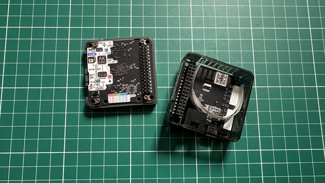

# docs/hybrid_ai/module_llm_kit.md

# M5Stack Module LLM Kit

This document describes the role of the M5Stack Module LLM Kit in the future Hybrid Edge AI architecture of the project.

---

# Overview

The image below shows the real M5Stack Module LLM Kit hardware used in the future Hybrid Edge AI roadmap of the project.



The M5Stack Module LLM Kit is an embedded AI acceleration platform designed to support local AI workloads and edge-side inference.

Official documentation:

https://docs.m5stack.com/en/module/Module%20LLM%20Kit

---

# Why This Device Is Important

The Module LLM Kit represents a future architectural transition from:

```text
Cloud-only AI
```

toward:

```text
Hybrid Edge AI
```

---

# Planned Experiments

The Module LLM Kit may later be used for:

- local inference
- lightweight models
- hybrid routing
- offline operation
- low-latency AI
- multimodal orchestration
- distributed AI systems

---

# Educational Importance

The Module LLM Kit allows students and developers to explore:

- embedded AI
- edge inference
- hybrid orchestration
- runtime optimization
- distributed intelligence
