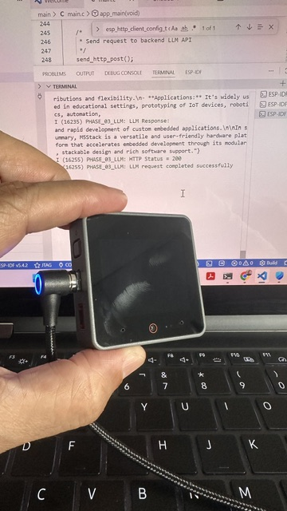

# Fase 03 — Integração Cloud LLM

> Status: ✅ ESP32 + Cloud LLM Totalmente Validados

---

# Visão Geral

A Fase 03 introduziu a primeira integração real de Inteligência Artificial do projeto.

A arquitetura evoluiu de:

```text
ESP32 → Backend
```

para:

```text
ESP32 → Backend → LLM → Response
```

e finalmente para:

```text
ESP32 → Backend API → OpenAI API → Streamed LLM Response
```

Esta fase validou oficialmente o conceito de:

```text
Thin Edge Device + Cloud Intelligence
```

utilizando hardware ESP32 real comunicando com uma LLM cloud real.

---

# Filosofia de Aprendizagem

Este projeto evoluiu propositalmente de forma incremental.

Cada subsistema foi validado independentemente antes da integração.

Ordem de desenvolvimento:

1. Fundação Wi‑Fi
2. Comunicação HTTP
3. Backend API
4. Orquestração OpenAI
5. Requests ESP32 → LLM
6. Respostas streaming LLM

Esta metodologia simplificou:

- debugging
- troubleshooting
- entendimento arquitetural
- isolamento subsistemas

---

# Arquitetura Final

```text
[ESP32-S3]
      ↓ HTTP JSON
[Backend REST API]
      ↓
[askLLM()]
      ↓ HTTPS
[OpenAI API]
      ↓
[Streamed LLM Response]
      ↓ HTTP JSON
[ESP32-S3]
```

---

# Hardware Utilizado

- M5AtomS3 Lite
- PC Windows
- Roteador Wi‑Fi local

---

# Arquitetura Backend

```text
backend/
├── README.md
├── README.pt-BR.md
│
├── api/
│   ├── server.js
│   ├── test_llm.js
│   └── snapshots/
│
├── llm/
│   └── openai.js
│
├── stt/
└── tts/
```

---

# Responsabilidades Backend

| Camada | Responsabilidade |
|---|---|
| api | comunicação REST |
| llm | orquestração IA |
| stt | speech-to-text futuro |
| tts | text-to-speech futuro |

---

# Evolução Snapshots

| Etapa | Arquivo | Descrição |
|---|---|---|
| 01 | step_01_wifi_http_base_main.c | Fundação Wi‑Fi + HTTP |
| 02 | step_02_llm_request_main.c | Primeiro request LLM bem-sucedido |
| 03 | step_03_llm_response_main.c | Primeira resposta LLM streaming exibida |

---

# Desenvolvimento Passo a Passo

## Etapa 01 — Criar API Key OpenAI

A API key OpenAI foi criada separadamente da assinatura ChatGPT.

Aprendizado importante:

```text
Planos ChatGPT e billing OpenAI API são serviços diferentes.
```

---

## Etapa 02 — Configurar Billing

Foi configurado pequeno saldo pré-pago.

Recomendado:

- 5 USD
- 10 USD

Suficiente para projetos educacionais.

---

## Etapa 03 — Instalar Dependências

Dentro de:

```text
backend/
```

Executar:

```bash
npm install openai dotenv express
```

---

## Etapa 04 — Criar .env

Dentro de:

```text
backend/api/.env
```

Conteúdo:

```env
OPENAI_API_KEY=sk-xxxxxxxx
```

---

# Regras de Segurança

O arquivo `.env` NUNCA deve ser enviado ao GitHub.

Adicionar ao `.gitignore`:

```gitignore
.env
```

A API key NUNCA deve permanecer em:

- firmware
- ESP32
- GitHub
- screenshots

---

## Etapa 05 — Criar openai.js

Arquivo:

```text
backend/llm/openai.js
```

Responsabilidades:

- conectar à OpenAI
- enviar prompts
- receber respostas
- isolar lógica provider

---

# Por Que Abstração Provider é Importante

O ESP32 NÃO conhece qual provider IA existe.

Hoje:

- OpenAI

Futuro:

- Ollama
- Gemini
- Claude
- LLMs locais

sem alterar firmware.

---

## Etapa 06 — Criar test_llm.js

Arquivo:

```text
backend/api/test_llm.js
```

Objetivo:

Validar comunicação LLM independentemente antes integração ESP32.

---

# Evolução REST API

## Backend Inicial

```text
POST /ping
```

Validou:

- REST
- JSON
- Express
- comunicação HTTP

---

## Backend IA

```text
POST /ask
```

Validou:

- integração OpenAI
- orquestração assíncrona
- respostas IA
- camada abstração backend

---

# Integração ESP32 + LLM

O ESP32 evoluiu de:

```text
cliente HTTP
```

para:

```text
edge device habilitado IA
```

O firmware agora:

- envia prompts
- recebe respostas IA
- trata payloads streaming HTTP
- exibe respostas LLM

---

# Aprendizado Importante ESP-IDF

A implementação inicial tentou utilizar incorretamente:

```c
esp_http_client_read_response()
```

Isso causava comportamento bloqueante durante respostas streaming.

A solução correta utilizou:

```c
HTTP_EVENT_ON_DATA
```

através de callbacks HTTP orientados a eventos ESP-IDF.

---

# Por Que HTTP Streaming é Importante

Grandes respostas LLM chegaram em múltiplos chunks.

Isso validou:

- HTTP orientado eventos
- tratamento payload streaming
- orquestração assíncrona
- comunicação IA cloud real

---

# Exemplo Saída ESP32

```text
PHASE_03_LLM: Sending HTTP POST...

PHASE_03_LLM: LLM Response:

{"response":"M5Stack is a modular embedded development platform..."}

PHASE_03_LLM: HTTP Status = 200

PHASE_03_LLM: LLM request completed successfully
```



---


# Troubleshooting Real

## Problema 01 — Diretório Incorreto

Erro:

```text
Cannot find module 'test_llm.js'
```

Causa:

Execução na raiz repositório.

Solução:

```bash
cd backend/api
```

---

## Problema 02 — dotenv Não Encontrado

Erro:

```text
Cannot find module 'dotenv'
```

Causa:

Dependências instaladas camada backend incorreta.

Melhoria arquitetural:

```text
backend/api/node_modules
```

tornou-se:

```text
backend/node_modules
```

Isso melhorou modularidade e escalabilidade.

---

## Problema 03 — Backend Não Executando

Sintoma:

```text
HTTP timeout
```

Causa:

ESP32 tentou conectar antes inicialização backend Node.js.

Solução:

```bash
node server.js
```

---

## Problema 04 — Resposta HTTP Bloqueante

Causa:

Tratamento incorreto resposta usando leitura bloqueante.

Solução final:

```c
HTTP_EVENT_ON_DATA
```

através callbacks assíncronos ESP-IDF.

---

# Conceitos Introduzidos

| Conceito | Descrição |
|---|---|
| LLM | Large Language Model |
| Thin Edge | dispositivo embarcado leve |
| Backend Proxy | camada abstração IA |
| dotenv | variáveis ambiente |
| Cloud AI | inteligência fora ESP32 |
| REST API | orquestração HTTP |
| HTTP Streaming | respostas chunked |
| HTTP orientado eventos | callbacks assíncronos |

---

# Validações Finais

| Funcionalidade | Status |
|---|---|
| Wi‑Fi | ✅ |
| DHCP | ✅ |
| HTTP POST | ✅ |
| REST API | ✅ |
| Backend orchestration | ✅ |
| OpenAI API | ✅ |
| Cloud LLM | ✅ |
| HTTP streaming | ✅ |
| ESP32 respostas streaming | ✅ |

---

# Estado Atual Projeto

| Fase | Status |
|---|---|
| Fase 01 — Fundação Wi‑Fi | ✅ Completa |
| Fase 02 — Comunicação HTTP | ✅ Completa |
| Fase 03 — ESP32 + Cloud LLM | ✅ Completa |

---

# Reflexões e Aprendizados

Esta fase demonstrou que sistemas embarcados modernos podem permanecer leves enquanto utilizam poderosos serviços IA cloud.

O projeto validou:

- Arquitetura Thin Edge
- Orquestração Cloud AI
- Comunicação REST embarcada
- Provider abstraction
- Networking orientado eventos
- Integração IA real

O ESP32 permaneceu leve enquanto toda inteligência executou na nuvem.

---

# Próximos Passos

Evolução futura planejada:

- parsing JSON
- extração respostas
- display CoreS3 Lite
- memória conversacional
- pipeline voz
- IA multimodal
- suporte LLM local
